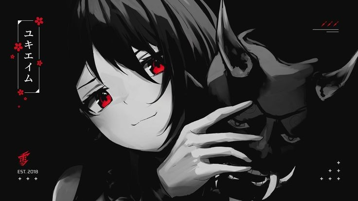

  

  <h3>Hi, I'm CodeE4X 👋</h3>
  
Solo Developer | Scripts Developer | Python Developer(api)

---

## 🌟 About Me  
- 🎩 **Introvert:** Some people call me introvert :)  
- 🙏 **Friends:** So hard to get **real** friends  
- 🤡 **Sigma:** yh im sigma
- 🤑 **Money:** I earn $8k/Month, I Work Become REDACTED Hat Hacker
- 🗣️ **People Think:** People call me like a guy  
- my prog language is over 16+ so i fckng lazy

---

  <h2>🛠️ Skills</h2>
  

---

## 📫 Connect with Me  

  
  
  
  

---

## 📂 Featured Projects  

  
  

---

## 🎯 Goals  

- Getting Rzzed

---

  <h3>✨ Thank you for visiting my profile! ✨</h3>
  
If you like my work, feel free to ⭐ some of my repositories!

